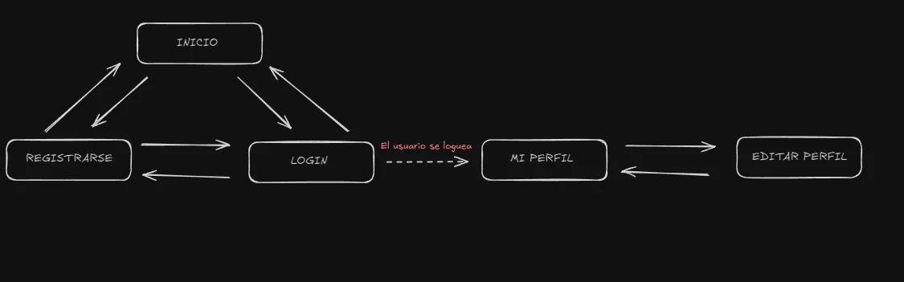
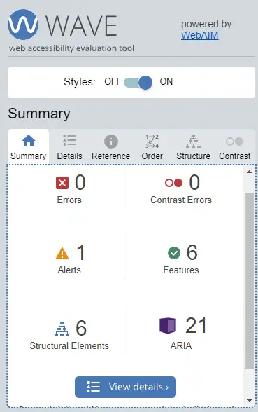
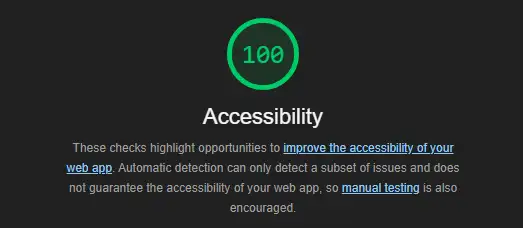
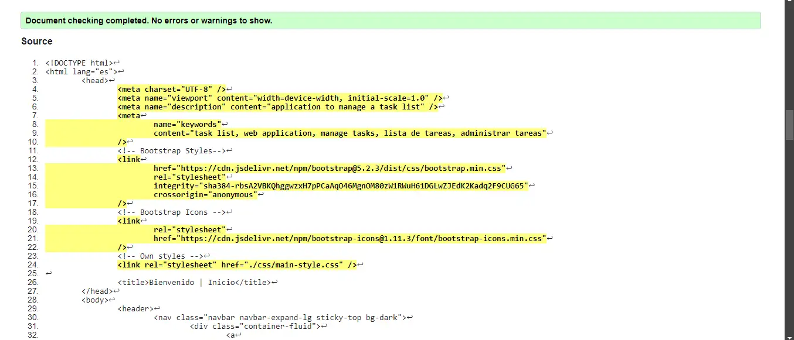
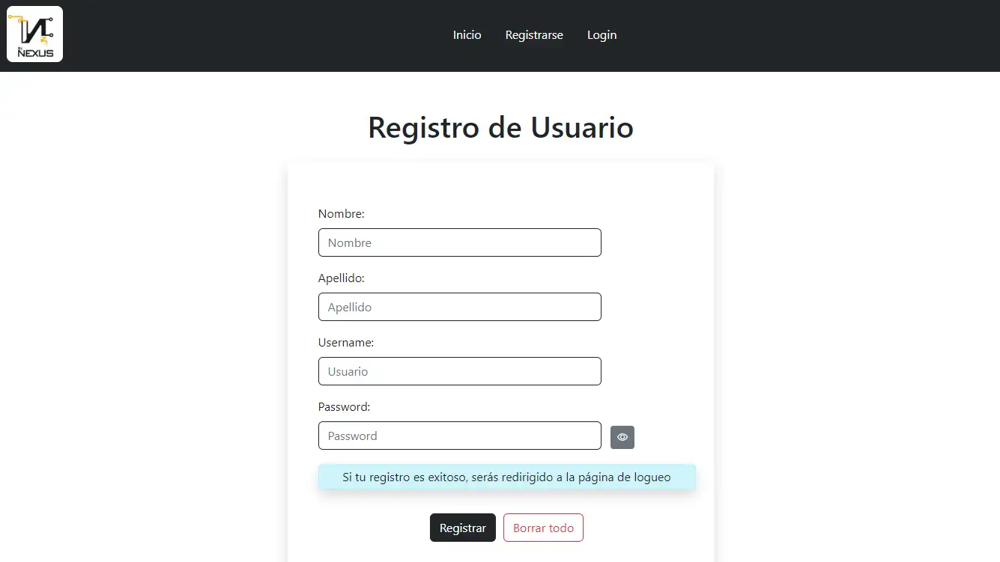
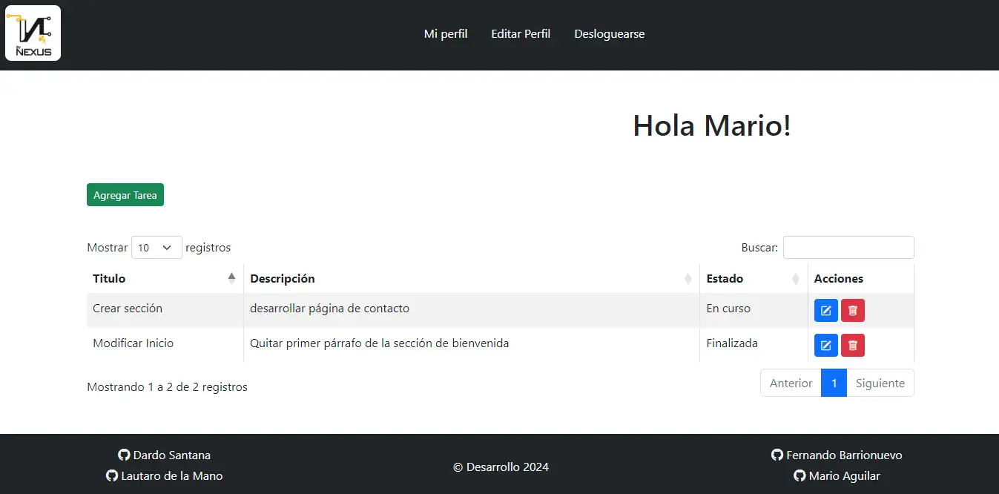
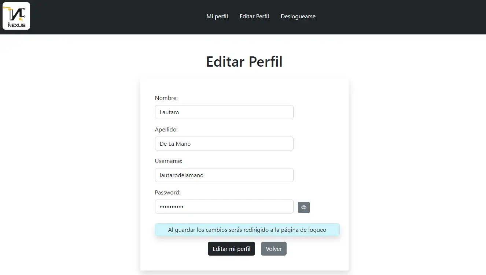
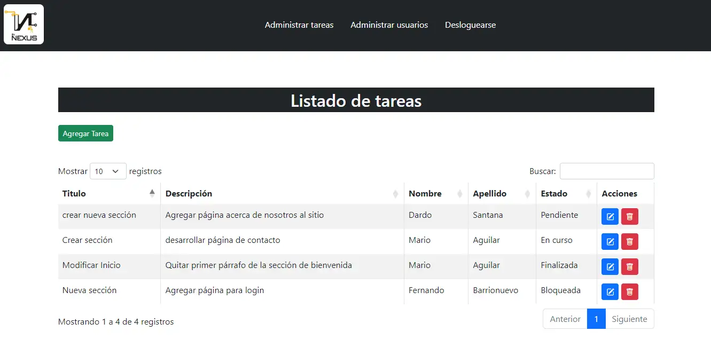
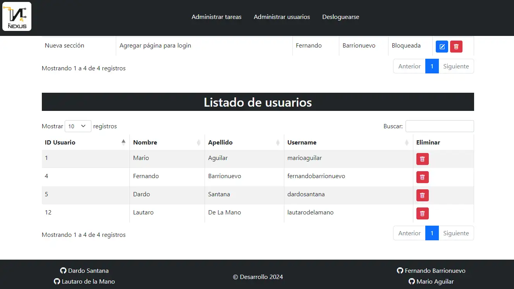

# Proyecto Final Grupo 3: By Nexus | To Do List

**Bootcamp CILSA Full Stack Developer**

## Integrantes del Equipo

- [Lautaro de la Mano](https://github.com/Lautidelamano)
- [Fernando Barrionuevo](https://github.com/Rasta0705)
- [Dardo Santana](https://github.com/dardosantana)
- [Mario Aguilar](https://github.com/mario-r-aguilar)

## Descripción del proyecto

Se trata de un sitio web pensado para que una empresa pueda proporcionarle
a un empleado una herramienta para gestionar sus tareas laborales diarias.
Es un MVP que permite al empleado crear su usuario, loguearse, agregar tareas,
editarlas, eliminarlas y también puede editar sus datos registrados si lo desea.
Además posee una vista de administración para gestionar tareas y usuarios.

## Indice

- [Arquitectura y Configuración de Entorno](#Arquitectura)
- [Instalación](#Instalación)
- [Base de Datos](#Motor)
- [Seguridad y Roles](#Seguridad)
- [Rutas](#Rutas)
- [Requests y Responses](#Ejemplos)
- [Manejo de Errores y Despliegue del Servidor](#Errores)
- [Estructura de Carpetas del Frontend](#Frontend)
- [Páginas y Navegabilidad](#Páginas)
- [Tecnologías del Frontend](#Tecnologías)
- [Colores](#Colores)
- [Accesibilidad](#Accesibilidad)
- [Capturas del Sitio](#Capturas)
- [Link](#Link)
- [Contribuir](#Contribuir)
- [Licencia](#Licencia)

---

## Backend

### Arquitectura

El backend está construido en **Node.js** con **Express.js** como framework. Se conecta a una base de datos MySQL utilizando la librería **mysql2** para realizar consultas SQL directas.
El patrón de arquitectura utilizado es **MVC** (Modelo-Vista-Controlador).

**Diagrama de flujo**

Frontend (HTML/CSS - Bootstrap/Javascript) → API REST (Express) → Base de datos (MySQL)

### Configuración del Entorno

**Requisitos previos**

- Node.js v22.2.0 o superior
- MySQL v8.0 o superior
- npm v10.8.0 o superior

**Dependencias**

- express v4.21.0
- mysql2 v3.11.3
- bcryptjs v2.4.3
- jsonwebtoken v9.0.2
- cookie-parser v1.4.6
- dotenv v16.4.5

**Variables de Entorno**

HOST: host de la base de datos
USER: usuario de la base de datos
PASSWORD: contraseña del usuario de la base de datos
DATABASE: nombre de la base de datos
JWT_SECRET: clave secreta para firmar tokens JWT
SECURE_COOKIE: modo de envío de la cookie donde se almacena el token (true para https / false para http)

_Ejemplo de archivo .env en entorno de desarrollo_

```
HOST=localhost
USER=admin
PASSWORD=adminpass
DATABASE=eccomerce
JWT_SECRET=secret
SECURE_COOKIE=false
ADMIN_NAME=username
```

[Ir al Indice](#Indice)

### Instalación

1. Clona el repositorio
   `git clone https://github.com/mario-r-aguilar/bootcamp-cilsa-proyecto-final.git`

2. Instala las dependencias
   `npm install`

3. Crea un archivo **.env** en la carpeta raíz del proyecto y configura las variables de entorno como se explico en el punto anterior.

4. Inicia el servidor en modo desarrollo
   `npm run dev`

[Ir al Indice](#Indice)

### Base de Datos

### Motor

El motor de base de datos utilizado es **MySQL** y se emplea la librería **mysql2** para realizar las consultas desde los modelos del servidor.

**Creación**

Para crear la Base de Datos accede a **MySQL Workbench 8.0 CE**, genera la siguiente query y ejecutala.

```
CREATE DATABASE database-name;
USE database-name;

CREATE TABLE user_table (
    user_id INT AUTO_INCREMENT PRIMARY KEY,
    user_name VARCHAR(100) NOT NULL UNIQUE,
    user_pass VARCHAR(255) NOT NULL,
    user_firstname VARCHAR(100) NOT NULL,
    user_lastname VARCHAR(100) NOT NULL
);

CREATE TABLE task_table (
    task_id INT AUTO_INCREMENT PRIMARY KEY,
    user_id INT NOT NULL,
    task_title VARCHAR(255) NOT NULL,
    task_description VARCHAR(255) NOT NULL,
    task_date_created DATETIME DEFAULT CURRENT_TIMESTAMP,
    task_date_modify DATETIME DEFAULT CURRENT_TIMESTAMP ON UPDATE CURRENT_TIMESTAMP,
    task_status VARCHAR(50) NOT NULL,
    CHECK (task_status IN ('pending', 'in progress', 'blocked', 'finished')),
    FOREIGN KEY (user_id) REFERENCES user_table(user_id)
);
```

**Conexión**

Crear un archivo para realizar la conexión a la base de datos. Cabe aclarar que los valores utilizados en este ejemplo son ficticios. De todas formas se sugiere el uso de variables de entorno en lugar de valores fijos. Luego de configurar la conexión podemos usarla en los archivos de los modelos.

```
import mysql from 'mysql2/promise';

const connection = await mysql.createConnection({
	host: localhost,
	user: admin,
	password: admin-pass,
	database: database-name,
});

export default connection;
```

**Entidades, Atributos y Modelo de Datos**

La base de datos posee dos entidades, a continuación los detalles de cada una.

**task_table**


Esta tabla contiene las tareas que se les asignan a los usuarios.
El atributo **task_id** es la clave primaria que se utiliza como identificador único de la tarea,
es un valor numérico y autoincrementadle. En tanto el atributo **user_id** es una clave foránea que
referencia a la _tabla user_, es un dato obligatorio. Cuando se crean o modifican las tareas se
registra la fecha y hora automáticamente (**task_date_created y task_date_modify**).
Asimismo, además de los atributos obligatorios **task_title** y **task_description**, tiene **task_status**, donde solo se admiten los siguientes estados: _pending, in progress, blocked y finished_.

**user_table**


Esta tabla contiene los datos del usuario.
Los atributos que contiene esta tabla son: el nombre de usuario (**user_name**), el cual debe
contener un valor único, su contraseña (**user_pass**) para el logueo en la
aplicación, el nombre (**user_firstname**) y apellido (**user_lastname**) de la
persona. Además, posee el atributo **user_id** que es la clave primaria utilizada como identificador
único de cada usuario.

**Relaciones**

Las relaciones que existen entre **user_table y task_table** son: Un usuario puede tener muchas tareas, pero una tarea solo tiene un usuario asignado. Podemos observar el **Diagrama Entidad Relación** lo mencionado con la cardinalidad incluída.


[Ir al Indice](#Indice)

### Seguridad

Una vez realizado el logueo en la aplicación, se genera un token mediante la librería JWT y se le incorpora el rol del usuario (USER o ADMIN) ya que no está contemplado dentro de la BBDD. Este token cuenta con una duración de 8 horas y se almacena en una cookie a través de cookieParser (misma duración).
La cookie se configura para no se puede acceder mediante JavaScript en el lado del cliente. Esto ayuda a proteger la cookie de ataques como el Cross-Site Scripting (XSS), ya que los scripts maliciosos no podrán leer su contenido. Asimismo se configura solo para ser enviada en solicitudes del mismo sitio, protegiendo contra ataques de Cross-Site Request Forgery (CSRF) que puedan ocurrir en solicitudes de terceros. Una vez en producción también se puede setear que solo pueda ser enviada a través de conexiones HTTPS.
También es conveniente aclarar que todos los passwords son hasheados utilizando bcrypt antes de ser almacenados en la base de datos y que los endpoints están protegidos mediante middlewares de autenticación y roles.

### Roles

Por defecto, al loguearse un usuario posee el rol USER. Para cambiar el rol del usuario a administrador (ADMIN), se debe agregar su username como valor de la variable de entorno.

`ADMIN_NAME=username`

Con esta configuración podrá ver el listado completo de tareas y quienes las tienen asignadas, podrá crear tareas y asignarlas a un usuario, podrá editarlas e incluso eliminarlas. Asimismo podrá ver el listado completo de usuarios y eliminarlos. Sin embargo no podrá crearlos, ni editarlos.
En cuanto al rol USER, podrá crear, editar y eliminar sus propias tareas. Además podrá editar su perfil.

[Ir al Indice](#Indice)

### Rutas

**Endpoints**

| Método | Ruta                   | Descripción                                       | Autenticación | Rol   |
| ------ | ---------------------- | ------------------------------------------------- | ------------- | ----- |
| GET    | `/api/user`            | Obtiene el listado total de usuarios              | JWT           | ADMIN |
| GET    | `/api/user/via/:uid`   | Obtiene un usuario por su ID                      | JWT           | TODOS |
| GET    | `/api/user/by/:usernm` | Obtiene un usuario por su username                | JWT           | TODOS |
| POST   | `/api/user`            | Crea un usuario en la base de datos               | -             | TODOS |
| PUT    | `/api/user/:uid`       | Actualiza los datos almacenados de un usuario     | JWT           | USER  |
| DELETE | `/api/user/:uid`       | Elimina un usuario de la base de datos            | JWT           | ADMIN |
| POST   | `/api/user/login`      | Loguea a un usuario                               | -             | TODOS |
| POST   | `/api/user/logout`     | Desloguea a un usuario                            | JWT           | TODOS |
| GET    | `/api/user/current`    | Obtiene los datos del usuario logueado            | JWT           | TODOS |
| GET    | `/api/task`            | Obtiene el listado total de tareas                | JWT           | ADMIN |
| GET    | `/api/task/:id`        | Obtiene una tarea por su ID                       | JWT           | TODOS |
| GET    | `/api/task/by/:uid`    | Obtiene el listado de tareas un usuario por su ID | JWT           | TODOS |
| POST   | `/api/task`            | Crea una tarea en la base de datos                | JWT           | TODOS |
| PUT    | `/api/task/:id`        | Actualiza los datos almacenados de una tarea      | JWT           | TODOS |
| DELETE | `/api/task/:id`        | Elimina una tarea de la base de datos             | JWT           | TODOS |

**Vistas**

| Ruta            | Descripción           | Autenticación | Rol   |
| --------------- | --------------------- | ------------- | ----- |
| `/`             | Página Inicio         | -             | TODOS |
| `/login`        | Página Login          | -             | TODOS |
| `/register`     | Página Registro       | -             | TODOS |
| `/profile`      | Página Mi Perfil      | JWT           | USER  |
| `/editprofile`  | Página Editar Perfil  | JWT           | USER  |
| `/adminprofile` | Página Administración | JWT           | ADMIN |

[Ir al Indice](#Indice)

### Requests y Responses

### Ejemplos

**User Routes**

> GET `/api/user`

_Response_

```
[
  {
    "user_id": 1,
    "user_name": "usuarioprueba",
    "user_firstname": "usuario",
    "user_lastname": "prueba"
  },
  {
    "user_id": 2,
    "user_name": "usertest",
    "user_firstname": "user",
    "user_lastname": "test"
  }
]
```

> GET `/api/user/via/:uid`
> GET `/api/user/by/:usernm`

_Response_

```
{
    "user_id": 1,
    "user_name": "usuarioprueba",
    "user_firstname": "usuario",
    "user_lastname": "prueba"
}
```

> POST `/api/user`

_Request_

```
{
  "user_name": "usuarioprueba",
  "user_pass": "secret",
  "user_firstname": "usuario",
  "user_lastname": "prueba"
}
```

_Response_

```
{
  "status": "success",
  "message": "User created successfully (controller's message)"
}
```

> PUT `/api/user/:uid`

_Possibles Requests_

1. Actualizar todos los campos

```
{
  "user_name": "usuarioprueba",
  "user_pass": "secret",
  "user_firstname": "usuario",
  "user_lastname": "prueba"
}
```

2. Actualizar campos específicos

```
{
  "user_name": "usuarioprueba"
}
```

_Response_

```
{
    status: 'success',
	message: "Updated user (controller's message)",
}
```

> DELETE `/api/user/:uid`

_Response_

```
{
	status: 'success',
	message: "Deleted user (controller's message)",
}
```

**Task Routes**

> GET `/api/task`

_Response_

```
[
    {
    "task_id": 1,
    "user_id": 4,
    "task_title": "Crear nueva sección",
    "task_description": "Agregar página acerca de nosotros al sitio",
    "task_date_created": "2024-10-01T21:56:26.000Z",
    "task_date_modify": "2024-10-01T21:56:26.000Z",
    "task_status": "pending"
  },
  {
    "task_id": 2,
    "user_id": 1,
    "task_title": "Deploy app",
    "task_description": "Deployar app en aws",
    "task_date_created": "2024-09-27T17:45:53.000Z",
    "task_date_modify": "2024-09-27T17:45:53.000Z",
    "task_status": "in progress"
  }
]
```

> GET `/api/task/:id`

_Response_

```
{
  "task_id": 2,
  "user_id": 1,
  "task_title": "deploy app",
  "task_description": "Deployar app en aws",
  "task_date_created": "2024-09-27T17:45:53.000Z",
  "task_date_modify": "2024-09-27T17:45:53.000Z",
  "task_status": "in progress"
}
```

> GET `/api/task/by/:uid`

_Response_

```
[
    {
    "task_id": 3,
    "user_id": 1,
    "task_title": "Crear nueva sección",
    "task_description": "Agregar página contacto al sitio",
    "task_date_created": "2024-10-01T21:56:26.000Z",
    "task_date_modify": "2024-10-01T21:56:26.000Z",
    "task_status": "pending"
  },
  {
    "task_id": 4,
    "user_id": 1,
    "task_title": "Corregir index",
    "task_description": "Corregir texto de bienvenida en index",
    "task_date_created": "2024-09-27T17:45:53.000Z",
    "task_date_modify": "2024-09-27T17:45:53.000Z",
    "task_status": "in progress"
  }
]
```

> POST `/api/task`

_Request_

```
{
  "user_id": "1",
  "task_title": "testing app",
  "task_description": "testear app",
  "task_status": "pending"
}
```

_Response_

```
{
	tatus: 'success',
	message: "Task created successfully (controller's message)",
}
```

> PUT `/api/task/:id`

_Possibles Requests_

1. Actualizar todos los campos

```
{
  "task_title": "testing app",
  "task_description": "testear app",
  "task_status": "pending"
}
```

2. Actualizar campos específicos

```
{
  "task_title": "testing app"
}
```

_Response_

```
{
	status: 'success',
	message: "Updated task (controller's message)",
}
```

> DELETE `/api/task/:uid`

_Response_

```
{
	status: 'success',
	message: "Deleted task (controller's message)",
}
```

[Ir al Indice](#Indice)

### Errores

### Manejo de Errores

El backend maneja errores y devuelve un formato consistente, incluyendo entre paréntesis,
el origen del error para poder hacer una correcta depuración (debug).
Ejemplo de un error 404 (tarea no encontrada):

```
{
	status: 'error',
	message: "The task does not exist (controller's error)",
}
```

### Despliegue del Servidor

Como se trata de un proyecto de práctica, alojamos el servidor en [**Glitch**](https://glitch.com/) que permite deployar proyectos **Node.js** tradicionales. En cuanto a la base de datos, la alojamos en [**FreeSQLdatabase**](https://www.freesqldatabase.com/). En ambos casos utilizamos planes gratuitos que poseen ciertas limitaciones. Sin embargo, el proyecto puede ser deployado en otras plataformas como Render, Railway, entre otras.

Para poder deployar el servidor en Glitch es necesario agregar una configuración en el package.json (puedes hacerlo directamente en la plataforma):

```
"engines": {
    "node": ">=14.17.6"
  },
```

y luego agregar las variables de entorno en el archivo .env que se te genera en la plataforma luego de subir tu proyecto desde GitHub. Una limitación que posee esta plataforma es que si realizas cambios en tu repositorio luego de haberlo subido, estos cambios no se reflejaran, deberás agregarlos manualmente.

Con respecto a la base de datos, si deseas alojarla en FreeSQLdatabase, tendrás que modificar la query. En este caso y dado que la base de datos es creada por la plataforma, solo modificaremos la forma de crear las tablas. Estos cambios aplican para todos aquellos hosting que poseen una versión antigua de MySQL.

```
-- Creación de la tabla usuario
CREATE TABLE user_table (
    user_id INT NOT NULL AUTO_INCREMENT,
    user_name VARCHAR(100) NOT NULL,
    user_pass VARCHAR(255) NOT NULL,
    user_firstname VARCHAR(100) NOT NULL,
    user_lastname VARCHAR(100) NOT NULL,
    PRIMARY KEY (user_id),
    UNIQUE KEY (user_name)
);

-- Creación de la tabla tarea
CREATE TABLE task_table (
    task_id INT NOT NULL AUTO_INCREMENT,
    user_id INT NOT NULL,
    task_title VARCHAR(255) NOT NULL,
    task_description VARCHAR(255) NOT NULL,
    task_date_created DATETIME,
    task_date_modify TIMESTAMP DEFAULT CURRENT_TIMESTAMP ON UPDATE CURRENT_TIMESTAMP,
    task_status VARCHAR(50) NOT NULL,
    PRIMARY KEY (task_id),
    FOREIGN KEY (user_id) REFERENCES user_table(user_id)
);
```

Asimismo tendrás que cambiar algunas líneas en el archivo **task.model.js**, más precisamente en la función **createTask** para que al agregar una tarea, se contemplen los cambios realizados en la creación de las tablas.

```
const now = new Date().toISOString().slice(0, 19).replace('T', ' ');

const [newTask] = await connection.execute(
  'INSERT INTO task_table (user_id, task_title, task_description, task_date_created, task_status) VALUES (?, ?, ?, ?, ?)',
  [user_id, task_title, task_description, now, task_status]
);
```

[Ir al Indice](#Indice)

---

## Frontend

Los archivos estáticos del frontend se encuentran dentro del servidor en la carpeta public.

### Estructura de carpetas

```
/public
    /css
    /img
    /js
    /pages
    index.html
```

**Descripción de la estructura**

- **/css:** Contiene el archivo CSS personalizado para agregar estilos o modificar los predeterminados de Bootstrap.
- **/img:** Contiene imágenes utilizadas en el sitio.
- **/js:** Contiene los archivos JavaScript para manejar la lógica y las interacciones de las páginas.
- **/pages:** Contiene el resto de páginas que componen el sitio.
- **index.html:** Archivo principal de acceso al sitio.

[Ir al Indice](#Indice)

### Páginas

El sitio se divide en dos secciones, la primera compuesta de una página **Inicio**,
una para **Registrarse** y una para el **Login**.
La segunda sección contiene la página del **Perfil**, donde verá el listado de tareas,
podrá crear una nueva, modificar las existentes o eliminarlas. Los formularios para
estas acciones se abriran en modales dentro de la misma página. También cuenta con
una página para **Editar sus Datos de Registro** y el botón para **Desloguearse**.

### Navegabilidad

Aquí se puede apreciar una interacción plena entre las páginas que pertenecen
a cada sección. En cuanto a la segunda sección, solo se puede acceder si el usuario está logueado,
ya que no hay vinculación directa entre las dos secciones.



[Ir al Indice](#Indice)

### Tecnologías

- **HTML**: Se utiliza en la estructura semántica del sitio.
- **CSS**: Se emplea principalmente para personalizar la navbar y footer.
- **Bootstrap v5.2.3**: Se usa para aplicar estilos a las páginas y para lograr que sean responsive.
- **Javascript**: Se emplea para realizar las validaciones de los formularios y para lograr dinamismo en la web.
- **Datatables v1.13.5**: Se utiliza para mostrar el listado de tareas y agregar controles interactivos a la tabla.
- **jQuery v3.6.0**: Se usa como complemento necesario de Datatables.

Las tecnologías como _Bootstrap, Datatables y JQuery_ se incorporan en el HTML mediante el uso de sus CDN. Para mayor información sobre ellas consulte la documentación oficial en sus páginas web.

[Ir al Indice](#Indice)

### Colores

Se utilizaron los colores incluídos en Bootstrap y se combinaron de manera que lograron un contraste adecuado, logrando así buena legibilidad del texto, mayor accesibilidad y mejor experiencia de usuario.

**Colores primarios**

- Color de Fondo Principal
  `#fff`

- Color de Texto Principal
  `#000`

- Color de los Botones

  | Fondo     | Texto     |
  | --------- | --------- |
  | `#0d6efd` | `#f8f9fa` |
  | `#198754` | `#f8f9fa` |
  | `#6c757d` | `#f8f9fa` |
  | `#dc3545` | `#f8f9fa` |

**Colores secundarios**

- Navbar y Footer

  | Fondo     | Texto  |
  | --------- | ------ |
  | `#212529` | `#fff` |

- Hover Navbar Links

| Fondo     | Texto  |
| --------- | ------ |
| `#6d6d6d` | `#fff` |

- Focus Navbar Texto Links
  `#fffb00`

- Hover Border bottom Footer
  `#1868aa`

[Ir al Indice](#Indice)

### Accesibilidad

**El sitio es completamente semántico, responsive y utiliza ARIA** (Accessible Rich Internet Applications) solo en los casos donde no existe una etiqueta semántica que cumpla la función.
El sitio ha sido probado con diferentes herramientas en línea como **WAVE y Lighthouse**, para comprobar problemas con accesibilidad y no se detectaron inconvenientes. También se comprobó la navegación mediante el teclado y utilizando el **lector de pantalla NVDA** con óptimos resultados.
Asimismo se verificó la estructura HTML con **W3C Markup Validation Service** para garantizar una correcta maquetación.







[Ir al Indice](#Indice)

### Capturas

Hay que tener en cuenta que los diseños originales, usados al momento de realizar esta documentación, pueden variar en relación a la versión actual del proyecto.

### Vista de usuario

**Inicio**


**Registrarse**



**Login**


**Mi perfil**




**Editar perfil**



### Vista de administrador

**Administración**





### Funcionamiento


[Ir al Indice](#Indice)

## Link

Puedes acceder a la versión navegable haciendo click [AQUÍ](https://to-do-list-bootcamp.glitch.me/)

[Ir al Indice](#Indice)

## Contribuir

1. Haz un fork del proyecto.
2. Crea una nueva rama (`git checkout -b feature-name`).
3. Haz commit a tus cambios (`git commit -am 'Añadir nueva funcionalidad'`).
4. Haz push a la rama (`git push origin feature-name`).
5. Crea un pull request.

[Ir al Indice](#Indice)

## Licencia

ISC License

Copyright (c) 2024 - Dardo Santana, Mario Aguilar, Fernando Barrionuevo y Lautaro De La Mano

Permission to use, copy, modify, and/or distribute this software for any purpose with or without fee is hereby granted, provided that the above copyright notice and this permission notice appear in all copies.

THE SOFTWARE IS PROVIDED "AS IS" AND THE AUTHOR DISCLAIMS ALL WARRANTIES WITH REGARD TO THIS SOFTWARE INCLUDING ALL IMPLIED WARRANTIES OF MERCHANTABILITY AND FITNESS. IN NO EVENT SHALL THE AUTHOR BE LIABLE FOR ANY SPECIAL, DIRECT, INDIRECT, OR CONSEQUENTIAL DAMAGES OR ANY DAMAGES WHATSOEVER RESULTING FROM LOSS OF USE, DATA OR PROFITS, WHETHER IN AN ACTION OF CONTRACT, NEGLIGENCE OR OTHER TORTIOUS ACTION, ARISING OUT OF OR IN CONNECTION WITH THE USE OR PERFORMANCE OF THIS SOFTWARE.

[Ir al Indice](#Indice)
